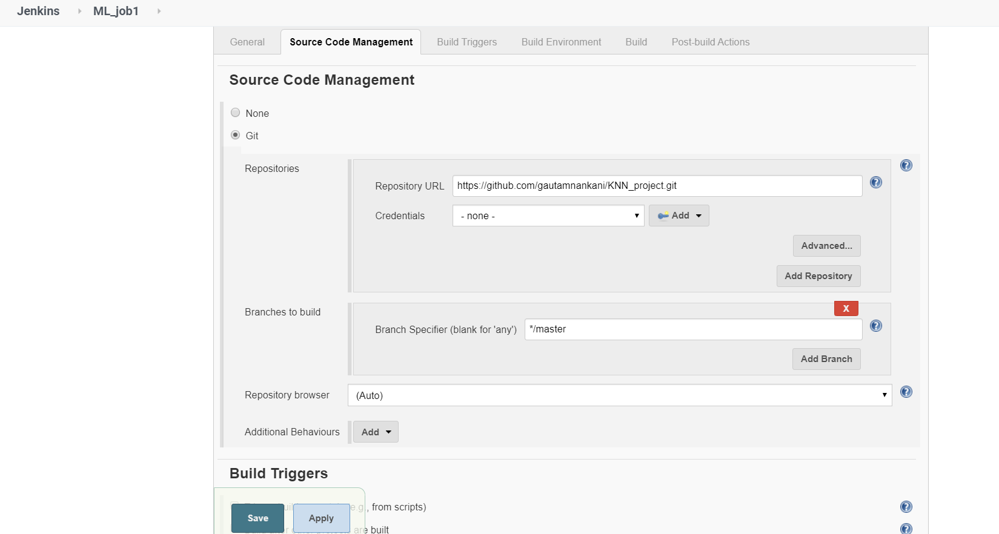
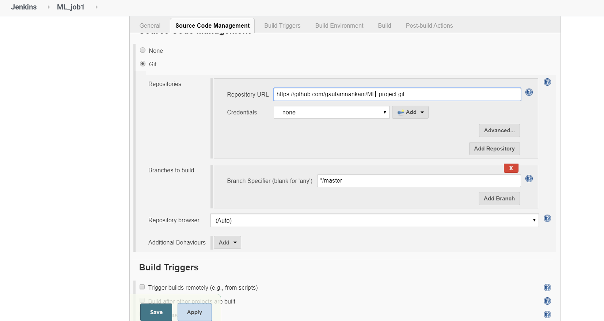
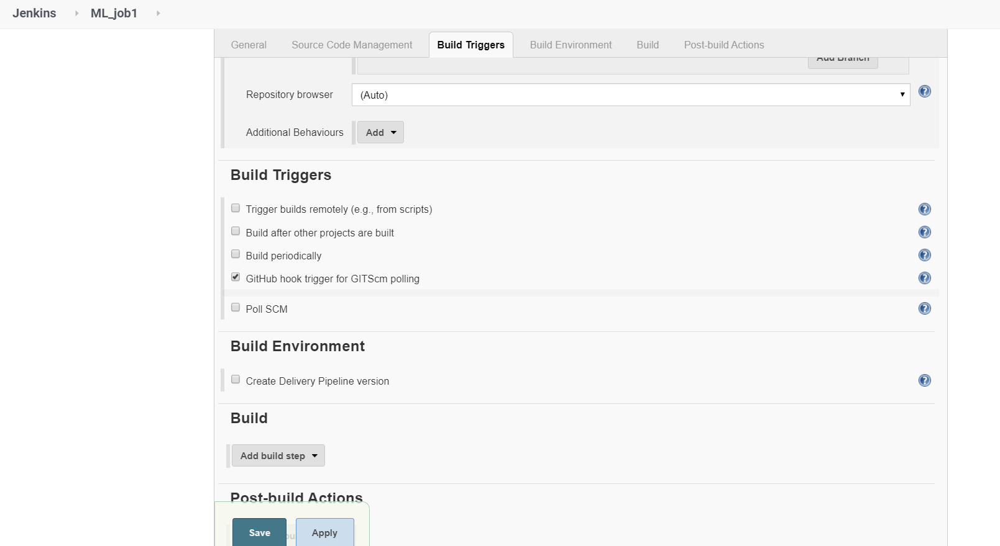
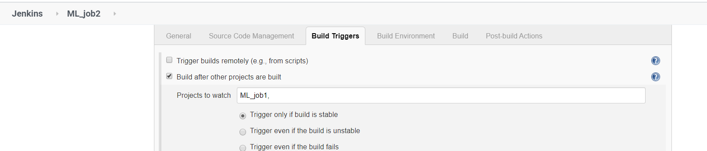
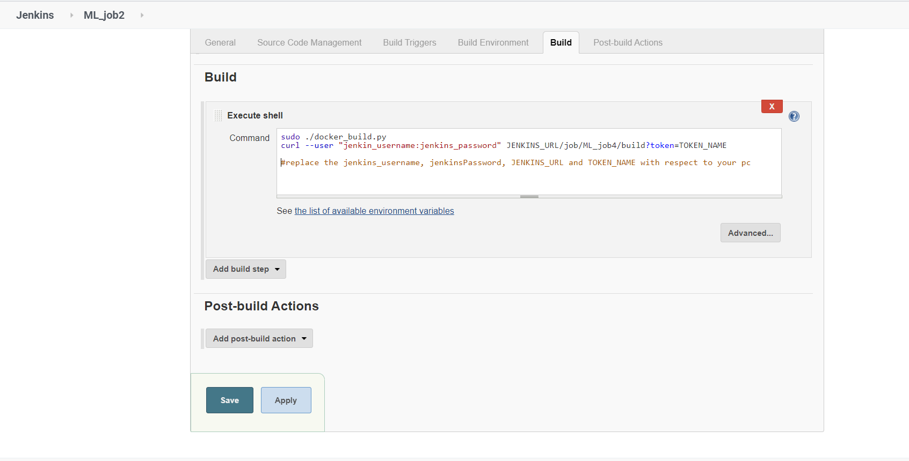
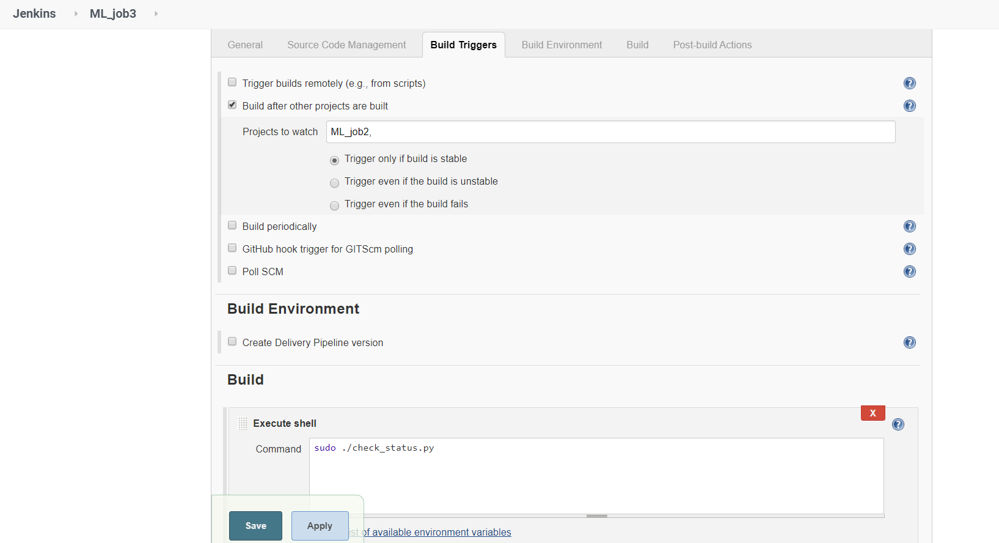
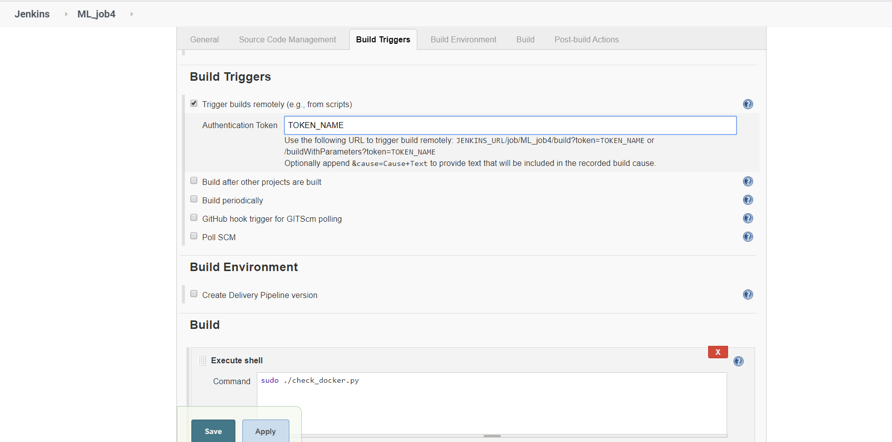
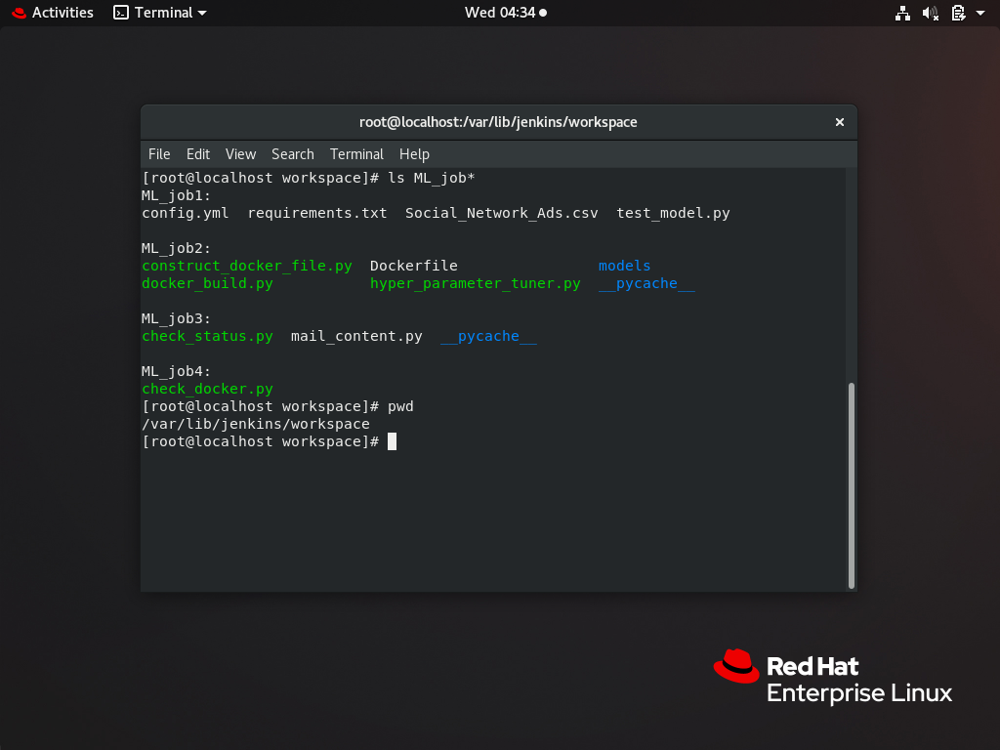
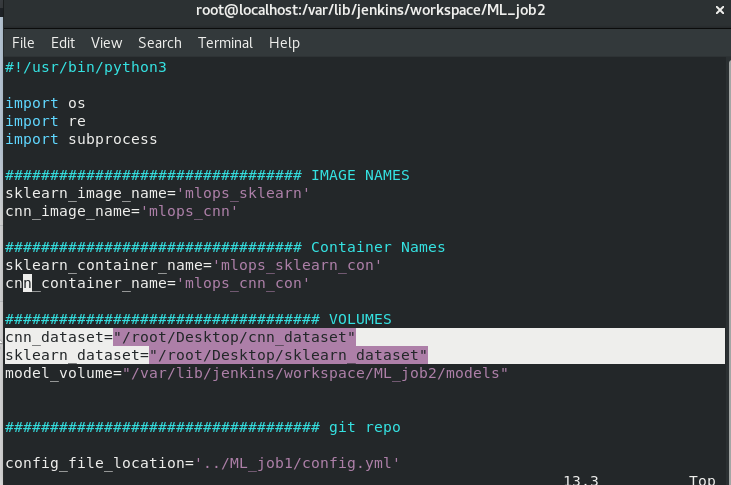
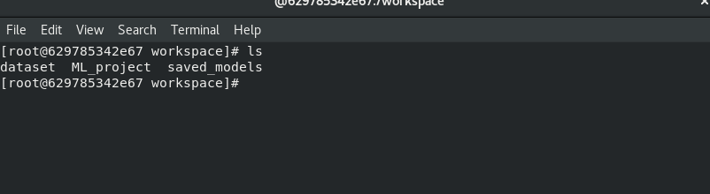

**ML/DL + DevOps:**

**Automated Hyper-Parameter Tuning:**

Have you done hyperparameter tuning in the ML model i.e. have you tried to change parameters again and again to improve the accuracy of your ML model. Doing it manually again-and-again running the script may lead to tiredness and mistakes. What will happen if you can choose all the parameters initially in a smooth and well-defined way and let the machine do everything (like changing the values,  training the model, saving it in some cases and also maintaining a dataset of accuracy for all the dataset you gave)

Wouldn't that be fun, if you let the machine do all this training stuff while you rest? Because that’s what this project here does for you.

You need just to push your code and a **_configuration file_** at GitHub, rest of the things will be taken care by Jenkins

**Note**: we will discuss the heart of this project i.e. **_configuration file_** later

Technologies used: Jenkins, docker 

Programming language: python

**Note**: If you think at any point in reading this why didn’t I use shell script then “bingo!” I initially thought the same, but I wanted to make it platform independent so i used python plus it offers a good variety of features.

**What this actually does:-**

**Below are set of 4 Jenkins jobs chains together**

**Job1:-**

> As soon as some changes occur in GitHub repo, it will automatically detect the changes and pull the repo

                                                                ‘**OR**’

**Job2:-**

> It will go through your code and make a docker file according to requirements/libraries

> It will build the image and also launch the container

> And also it will start training your ML model by tweaking/changing hyperparameter on each run

>In some cases like CNN it will save your models in different files each.

>It will save statistics i.e. value of hyperparameters with the corresponding accuracy

Note:  If you are new to these terms. In simple words you can assume it will make an environment to train you ML model, will start training  and save all the statistics i.e. accuracy with the corresponding hyperparameter

**Job3:-**

> After the training on all the Hyper-Parameters is complete, it checks the accuracy of all the training(with different hyperparameter) and will send an email telling the highest accuracy and corresponding hyperparameter values(So it can be used further)

**Job4:-**

> It monitors the docker if docker stops, then will check if the training is complete and if not then it will restart the container and start training the model from where it previously left.

**REVEALING THE STRATEGY:**

By now you might be thinking how is it possible, In this project, the mandatory thing is you have to write a configuration file, Oh NO!

Wait for it, we have made the configuration file so simpler that even a kid can write it, If you are familiar with YAML file then congratulations we are going to use it, If you are not below is all the procedure and samples

config.yml FILE________________________________________________________________

    # YAML file
    # constraints: all the variables in function should have "," after the value eg:- (var=val,)
    #In cnn: model.fit must be stored in a variable and the variable name must be written here in ModelFitVariable 

    RepoURL: https://github.com/gautamnankani/ML_project.git

    RepoName: ML_project
    
    Name: First_model
    
    Kind: CNN
    
    Counter: 2
    
    AccuracyVariable: accuracy
    
    HyperParameter:
    
      HYP1:
         filters: [32,64]
         
      HYP2:
         filters: [32,64]

____________________________________________________________________

Explanation:

   > RepoURL:    URL of GitHub where your _code(test_model.py), requirements.txt, config.yml_ file is stored.                                                                                                                                                                       Open this link to see file namings: https://github.com/gautamnankani/ML_project.git

   > RepoName: Write the repo name of your Github repo

   > Name: This is the name you have to assign to a project for each time you push(The name must be different at each time you push,)

   > Counter: These are number of time you want to change Hyper-Parameters(Number of times you want to perform tuning)

   > AccuracyVariable: Store the accuracy of your model into a variable and write the variable name here as shown(In my case variable name is ‘accuracy’)

   > HyperParameter: These are the main part for what we want to change, Let me explain you with the example written above

    EXAMPLE:

     HYP1:

         filters: [32,64]

         Activation: [ 'relu', ‘tanh’ ]

    See the below code for it

    #SHYP1

    model.add(Convolution2D(filters=32, 

                            kernel_size=(3,3), 

                            activation='relu',

                       input_shape=(64, 64, 3)

                           ))

    #EHYP1

    For HYP1:   we add two comments to our code   1) **#SHYP1**  (i.e Start HYP1)

                                                  2) **#EHYP1  **(i.e. End HYP1)

   Similarly for HYP2 and so on,
   Here we want to change the variable named filters that's why we write the variable name filters in the config file so we are telling to replace the values one by one with the mentioned list [32, 64]

   Note: The list length must be equal to the **Counter **value mentioned above and also there must be a comma  Eg: filter= 32 ,      
   Similarly activation and other things

   This might be a bit confusing but reading you can go through it more than ones and can refer below GitHub links containing CNN, KNN examples
   
   [CNN link](https://github.com/gautamnankani/ML_project.git)
   
   [KNN link](https://github.com/gautamnankani/KNN_project.git)

   And if still, any problem can contact me on LinkedIn: [my LinkedIn](https://www.linkedin.com/in/gautam-nankani-667509180)

   How Code looks like some more eg__________________________________________

    #!/usr/bin/env python3
    
    #SHYP1
    model.add(Convolution2D(filters=32, 
                            kernel_size=(3,3), 
                            activation='relu',
                       input_shape=(64, 64, 3)
                           ))

    #EHYP1

    #SHYP2
    model.add(Convolution2D(filters=32, 
                            kernel_size=(3,3), 
                            activation='relu',
                           ))
    #EHYP2

    accuracy=&lt;accuracy of this model>

    ___________________________________________________________

requirements.txt:

   This file contains all the additional libraries you want to install. however, it is not compulsory to write it but is a good practice.

**Future Scope**:

> Currently it supports: sklearn and Keras model training

    Solution: More support can be easily added, and will be added on request

> Make it more widely usable by adding more features

> Provide a much more user-friendly environment

**The program files used in the above jobs**:

The above Jenkins jobs folders (copy all the folders present inside the GitHub repository to (/var/lib/jenkins/workspace/) if using Linux

It looks like:

Note: ML_job1 will be cloned from GitHub as you can see on the screenshot above

Jenkins Job Link:

   [Jenkins Job Link](https://github.com/gautamnankani/MLops_HyperParameter_automated_tuning)

For time being the code might not look good to read but it works, and I will make it readable soon so it will be easy to debug + plus if you face any issue feel free to contact me 

Tested code against the above jobs:

   [CNN link](https://github.com/gautamnankani/ML_project.git)    (Note in this dataset was big so I used docker volume concepts to attach the volume with docker container will discuss the file structure later)

   [KNN link](https://github.com/gautamnankani/KNN_project.git)    (You can test this code against your job because the dataset is small so you can push the dataset with code)

Try for the file/folders names to be same otherwise you have to change it in all the programs/code

This limitation will be removed in the future version on the basis of your response, so please like or comment or give the feedback if you don’t like it

**If you want to test the codes yourself **

**Note:**

Make the folder name-> 

/root/Desktop/cnn_dataset                 (to keep cnn dataset)

/root/Desktop/sklearn_dataset           (to keep sklearn dataset)

This is the container workspace look like:

Remember one of the above folders will be linked to this dataset folder/directory below

And ML_project is cloned as it is  [CNN link](https://github.com/gautamnankani/ML_project.git) 

Now remember in your code to access dataset you have to come back a folder and the access dataset i.e. ‘’../dataset’’ in test_model.py

Check this link test_model.py  [CNN link](https://github.com/gautamnankani/ML_project.git) 

Note: In ML_job3 there is a file mail.content fill the emails and password there, so you can recieve notification

Thanks
